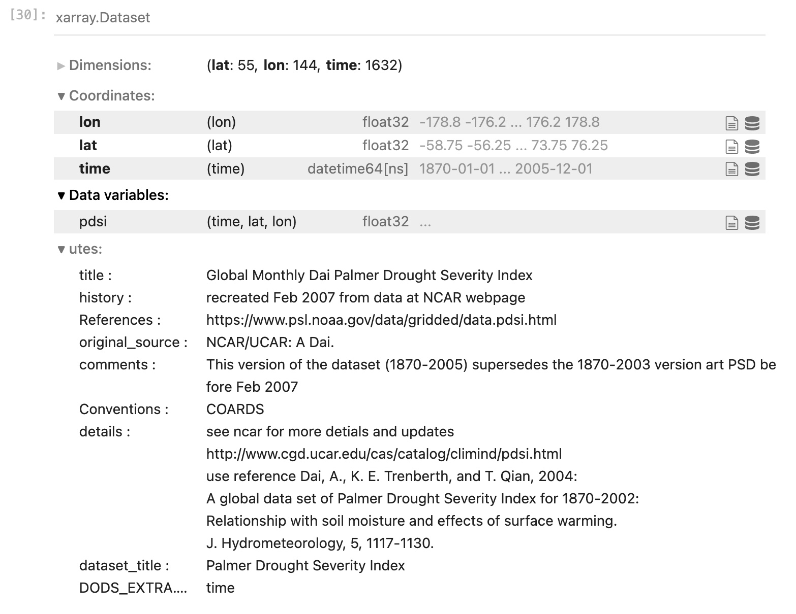
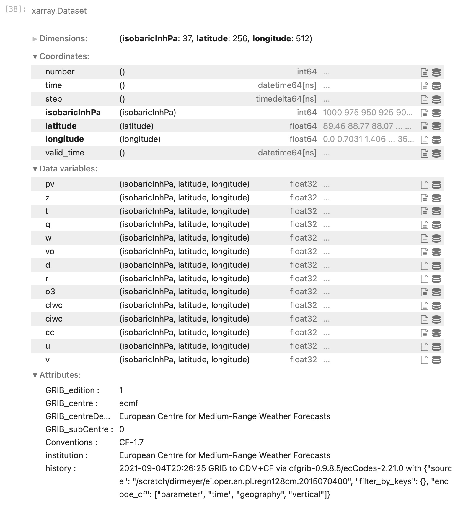

### OPeNDAP

OPeNDAP (Open-source Project for a Network Data Access Protocol) is s a data server architecture 
that allows access to remote datasets within many different software packages including Python.  
Opening a remote file via OPeNDAP is as easy as opening a file on local disk, except a URL to the dataset is supplied instead of a path on local disk.
Regardless of the native data file format, OPeNDAP presents it to the client software in a NetCDF-style format.

When a file is opened via OPeNDAP, only the metadata is initially passed to the client. 
Just the specific slices of variables used in a calculation are sent over the Internet, not the entire dataset.
Thus, it can be much more efficient than downloading a large dataset and only using a small part of it.
However, performance of code using OPeNDAP depends on the speed of the Internet connection to the data server.

### OPeNDAP in `xarray`

To open and use remote datasets in Python served via OPeNDAP, we use the `xarray` function `open_dataset()` in exactly the same way as before. 
This time, let's look at a different dataset from the NOAA PSL repository. 
Let's look at the [Palmer Drought Severity Index](https://psl.noaa.gov/data/gridded/data.pdsi.html) page and select the OPeNDAP file name for the self-calibrated version.

In a new code cell, type the following (you can copy and paste the dataset path from the web page):

~~~
url = "https://psl.noaa.gov/thredds/dodsC/Datasets/dai_pdsi/pdsi.mon.mean.selfcalibrated.nc"
dd = xr.open_dataset(url)
~~~
{: .language-python}

This probably took a few seconds, whereas opening the local file was nearly instantaneous. 
There was some communication over the Internet to establish a link between your Python process 
running in a Jupyter Notebook on the COLA computer and the remote data server (which sits in Boulder, Colorado).

As before, query the new object `dd` by typing its name and `<return>`:
  
~~~
dd
~~~
{: .language-python}

In the same format as before you will see the metadata pertinent to this dataset.
There is only one data variable, the horizontal resolution is a bit lower 
(the spatial dimensions of the arrays are smaller) but the time dimension is much larger.

The dimensions of this data are again in the order: `[time, lat, lon]` (always check before you move forward!), 
so we may make a quick plot of this data. This time, let's plot the last time step:

~~~
plt.contourf(dd["pdsi"][-1,:,:]) ; plt.colorbar()
~~~
{: .language-python}

Things to note:
1. There was more hesitation - although the spatial grid is smaller than the SST data we downloaded to disk, 
we had to retrieve the data over the Internet. 
If we were only interested in the last month, or last year, of this 164-year dataset, 
this would be more efficient than downloading the whole file first. However, if we wanted to do a number of
different calculations using the whole time series, it might be better in the long run to download it.
2. It's not upside down! If you noticed when you queried the metadata, the latitudes start at 
-58.75 and count up to 76.25. So we also see it is not a full global grid, but it excludes Antarctica and 
areas north of the Arctic Circle.
3. We added a colorbar using a different `pyplot` function. 
4. Also note that we put two separate Python commands on the same line separated by a semicolon. 
This is valid syntax in Python - you do not have to have one command per line.

### Opening a GRIB file in `xarray`

GRIB format is used by operational weather forecast centers around the world for forecast model output. 
Let's go back to our terminal window and copy the following file to your scratch directory:

~~~
$ cd /scratch/<your_username>
$ cp /shared/working/rean/era-interim/daily/data/2015/ei.oper.an.pl.regn128cm.2014020800 test.grb
~~~
{: .language-bash}

Back in our Jupyter notebook, let's open a new code cell and proceed to open this GRIB file containing data from the ERA-Interim reanalysis from ECMWF:

~~~
gribfile = "/scratch/<your_username>/test.grb"
dg = xr.open_dataset(gribfile,engine='cfgrib')
~~~
{: .language-python}

We had to specify an "engine" that knows how to read a GRIB file. 
If you look in your scratch directory, you will find a new file has been created. 
Because GRIB files are extremely compressed, down to the bit level, an index file (ending in `.idx`) 
is generated from the metadata that holds a mapping of the exact places on disk where each grid starts, and specific information on how to 
uncompress each grid. This speeds up the navigation and processing of the dataset.

Examine the file's metadata:

~~~
dg
~~~
{: .language-python}

Note that here we again have 3 dimensions, but time is not one of them. 
These are global grids at a single date/time, but across 37 pressure levels (the coordinate `isobaricInhPa`)

Expand the attributes of any data variable and have a look.

Finally, make a plot of one of the variables at a particlar pressure level 
(something you might be familiar with like `t` temperature or `u` zonal wind). 
Do you remember the syntax? Can you add a colorbar?


